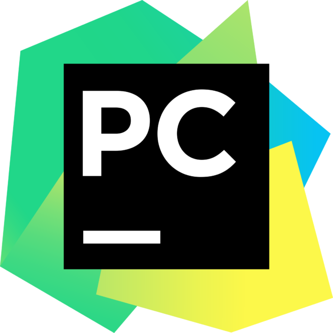

<h1 align="center">
<!--      -->
  Hi , I'm Nitin Roy
</h1>

  

<h3 align="center">
  

    Computer Science Engineering student with problem-solving skills and ability to perform well in groups
  

</h3>

 

- 🔭 I’m currently working on **Flask, Django**.

- 🌱 I'm currently learning **DSA, Machine Learning**.

- 👯 I’m looking for collaborate on projects.

- 👨‍💻 My projects are available at [https://github.com/roynitin710/](https://github.com/roynitin710/).

- 📝 Connect to me at
[https://www.linkedin.com/in/nitin-roy-8704a91ba/](https://www.linkedin.com/in/nitin-roy-8704a91ba/).

- 📫 Reach me at [https://www.instagram.com/roynitin710/](https://www.instagram.com/roynitin710/).

- 💬 Ask me **Programming** related doubts.

  

<h3 align="left">Languages and Tools</h3>

  
  
  
  
  
  
    
  
  
  
  
  
  

 

 

<h3>🏆 Github Profile Trophy</h3>
  

 

<h3 align="left">Connect with me</h3>

  

  &nbsp;&nbsp;&nbsp;&nbsp;
  &nbsp;&nbsp;&nbsp;&nbsp;
  &nbsp;&nbsp;&nbsp;&nbsp;

<h1 align=center>Happy Coding 👨‍💻</h1>

 

<h3 align="left">Overall profile stats</h3>

  

  

  

 

  

<!---  --->
